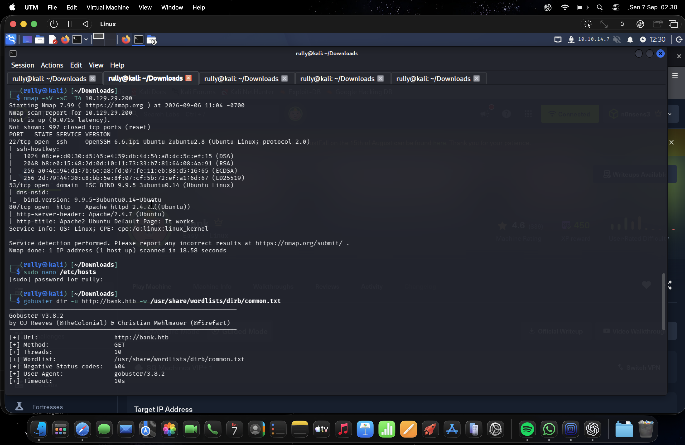
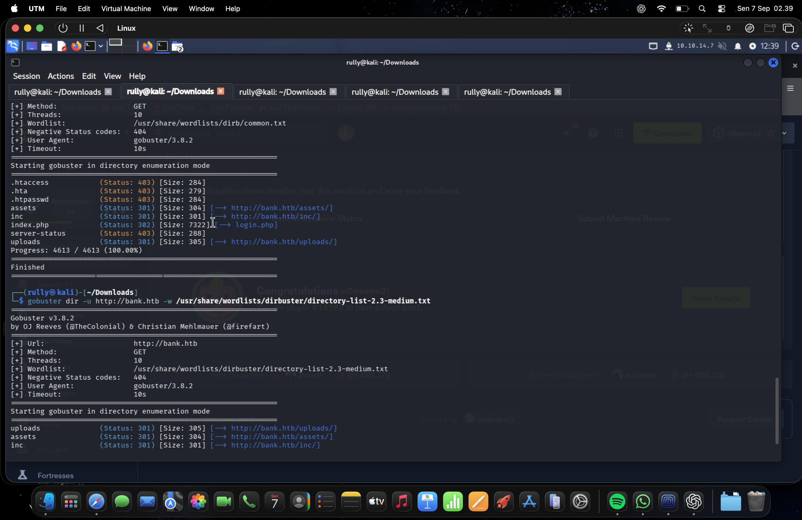
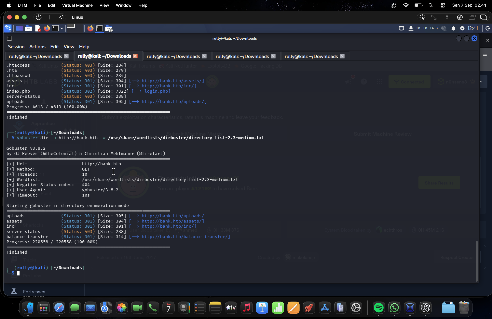
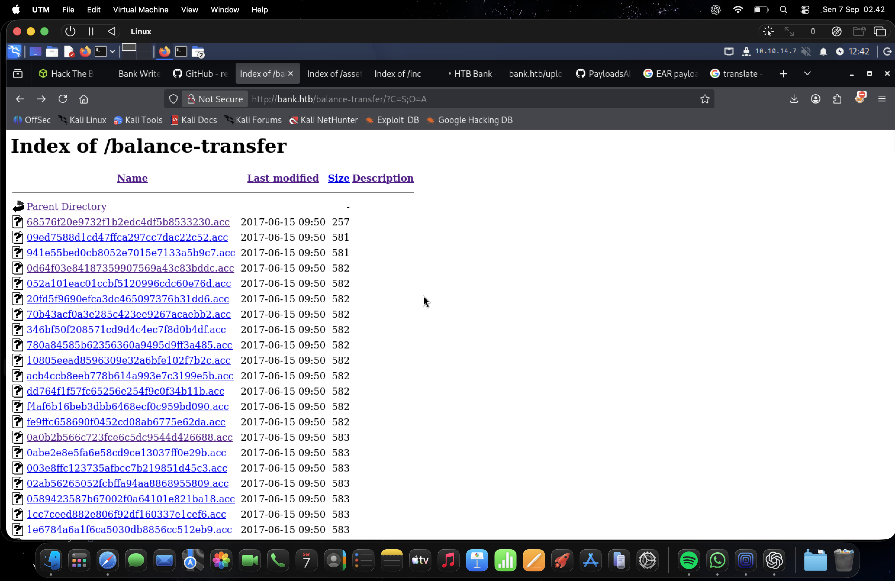
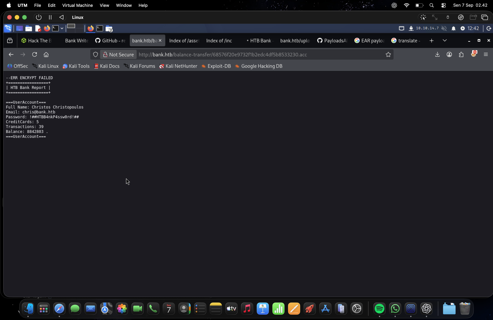
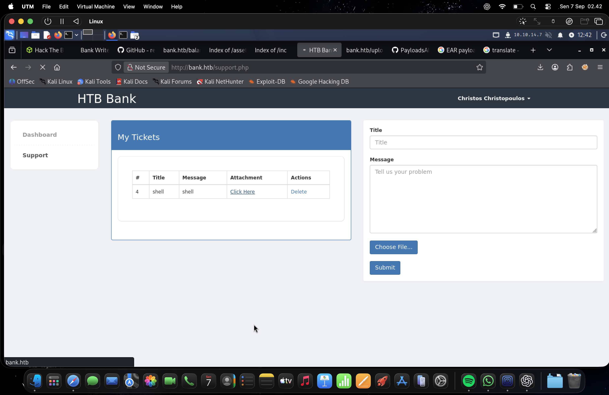
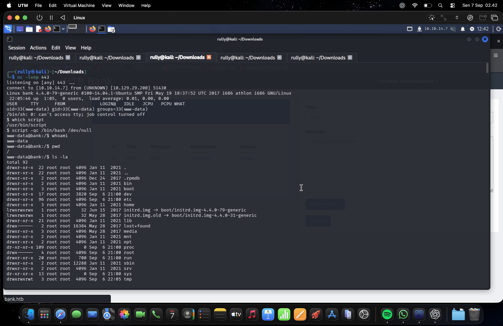
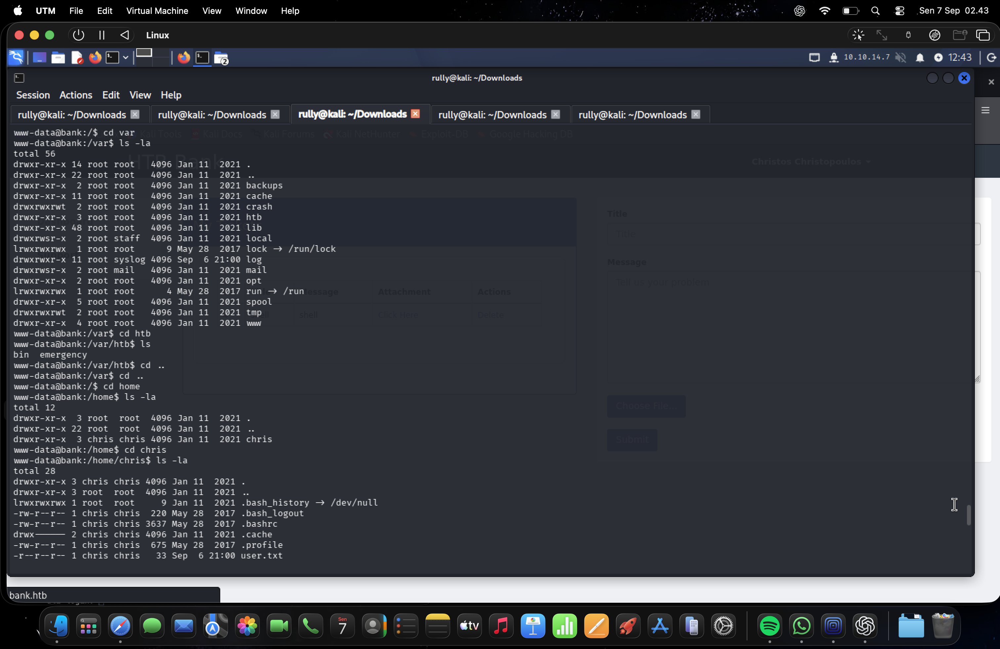
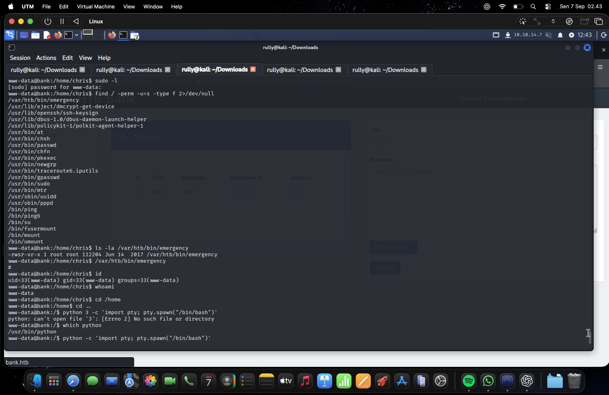
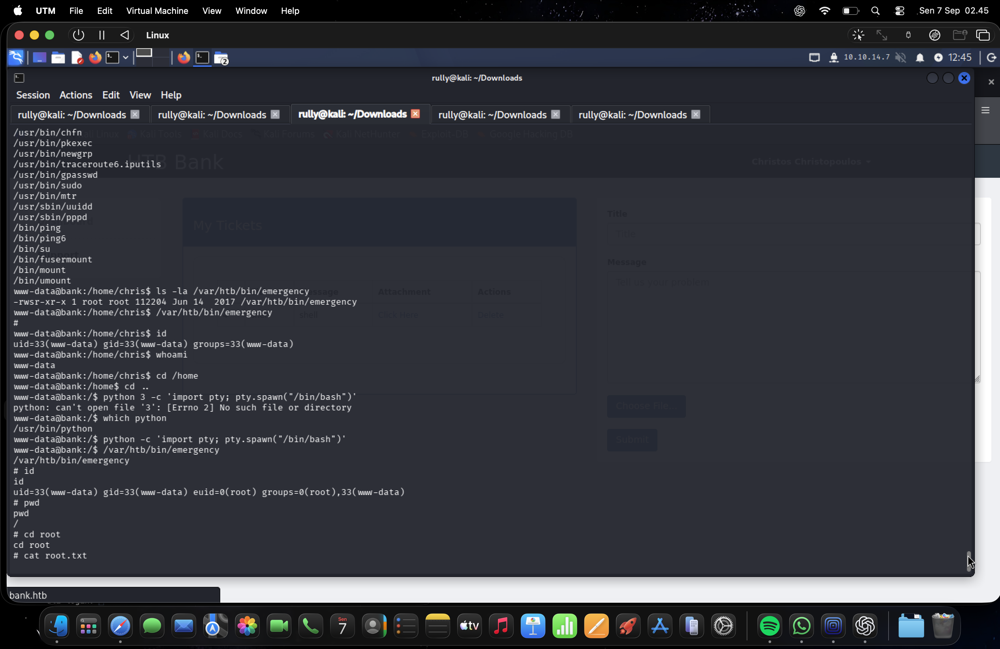

# Hack The Box: Bank — CTF Report

| Item | Details |
| --- | --- |
| Platform | Hack The Box |
| Machine | Bank |
| Target address recorded in the evidence | `10.129.29.200` |
| Application hostname | `bank.htb` |
| Target operating system | Linux / Ubuntu, as reported in the captured output |
| Working environment | Kali Linux running in UTM |
| Screenshot date | 7 September 2026, according to the supplied filenames and macOS clock |
| Evidence set | Ten screenshots supplied by the participant, identified as E01–E10 |
| Confirmed technical outcome | A shell with effective user ID `0` (`root`) |

## 1. Executive Summary

The supplied screenshots document work on the Hack The Box **Bank** machine, progressing from service discovery to an authenticated web session, a shell running as the web service account, and effective root privileges.

Service enumeration identified SSH, DNS, and HTTP. Web content discovery subsequently revealed a directory containing account reports. One unusually small report displayed an encryption failure message and exposed account information, including a plaintext password. A later screenshot showed the application authenticated as the same account holder.

The authenticated support page contained a ticket with an attachment. Subsequent terminal evidence confirmed a connection from the target and a shell running as `www-data`. This sequence is consistent with initial access through the support attachment feature, although the screenshots do not show the uploaded file, its contents, or the request that triggered execution.

Local inspection identified a root-owned executable with the SUID permission enabled. The final screenshot showed a shell with `euid=0(root)`, confirming effective root access. The Hack The Box page visible behind the terminal also displayed a message indicating that Bank had been solved. Neither flag value is visible in the supplied evidence.

## 2. Scope and Evidence Basis

This report describes the participant's completed CTF activity using only the ten supplied screenshots. It is a record of observed actions and results; no additional scans, exploitation attempts, or external walkthroughs were used to prepare it.

Statements are distinguished as follows:

- **Observed:** directly visible in a screenshot.
- **Inferred:** a reasonable connection between screenshots that does not have a complete visual record.
- **Not captured:** information that cannot be established from the supplied evidence.

Screenshot timestamps establish the order of the supplied captures, not the exact duration or order of every underlying action. The host and guest clocks differ, and several captures contain earlier terminal output. The platform completion message is already visible in earlier captures, so the screenshots should not be treated as a continuous live execution timeline.

## 3. Tools Observed

| Tool | Role shown in the evidence |
| --- | --- |
| Nmap 7.99 | Service and version discovery |
| Gobuster 3.8.2 | Web directory and file discovery |
| Firefox | Inspection of account reports and the support application |
| Netcat | Receipt of the connection associated with the target shell |
| Linux shell utilities | Identity checks, directory inspection, and permission enumeration |
| `script` and Python | Terminal session setup attempts |

## 4. Documented Assessment

### 4.1 Service Discovery

**Evidence: E01**

The captured Nmap scan reported the target as reachable and identified three open TCP ports:

| Port | Service | Reported version or observation |
| --- | --- | --- |
| `22/tcp` | SSH | OpenSSH 6.6.1p1 Ubuntu 2ubuntu2.8 |
| `53/tcp` | DNS | ISC BIND 9.9.5-3ubuntu0.14 |
| `80/tcp` | HTTP | Apache httpd 2.4.7 on Ubuntu |

The scan also reported 997 closed TCP ports. These results describe the captured scan scope; they do not establish the state of every possible TCP or UDP port.

The HTTP title returned during the IP-based scan was the Apache2 Ubuntu default page. Later activity used `bank.htb`. The terminal shows the local hosts file being opened for editing, but its final contents are not displayed. The evidence therefore supports subsequent use of the hostname without independently showing the exact hosts-file entry.

The service banners provide environment context. No screenshot demonstrates exploitation of SSH, DNS, or a vulnerability in any specific reported software version.

### 4.2 Web Content Discovery

**Evidence: E01–E03**

An initial Gobuster scan used the `common.txt` wordlist. A subsequent scan used `directory-list-2.3-medium.txt` and revealed an additional account-report directory.

| Resource | Captured HTTP status | Observation |
| --- | --- | --- |
| `/assets/` | `301` | Redirect to the directory URL |
| `/inc/` | `301` | Redirect to the directory URL |
| `/uploads/` | `301` | Redirect to the directory URL |
| `/index.php` | `302` | Redirect to `login.php` |
| `/balance-transfer/` | `301` | Additional directory found during the larger scan |
| `/server-status` | `403` | Access forbidden in the captured response |

The initial scan also returned `403` for `.htaccess`, `.hta`, and `.htpasswd`. These responses did not disclose the contents of those resources.

The discovery of `/balance-transfer/` was the main result of the expanded enumeration. The completed output shows that this directory was found after the first wordlist had already finished.

### 4.3 Exposed Account Reports

**Evidence: E04–E05**

The browser displayed a directory index for `/balance-transfer/` containing numerous `.acc` files. The listing was sorted by size, placing a **257-byte** report above files of approximately **581–583 bytes** in the visible portion of the page.

Opening the smaller report displayed the message `--ERR ENCRYPT FAILED` and readable account fields. These included:

| Field | Observation |
| --- | --- |
| Account holder | Christos Christopoulos |
| Email | `chris@bank.htb` |
| Password | A plaintext value was visible; it is not repeated in this narrative |
| Other information | Credit-card count, transaction count, and account balance |

The report's exposure demonstrates a sensitive-data disclosure. The error message is consistent with a failed protection step, but the screenshots do not show the implementation responsible for that failure or prove how every other report was protected.

Directory indexing made the reports and their relative sizes easy to inspect. The underlying problem also included direct web access to sensitive report contents; disabling the index alone would not address that exposure.

### 4.4 Authenticated Application Access

**Evidence: E06**

The support page showed an authenticated session under the name **Christos Christopoulos**, matching the exposed account report. The page contained a ticket form with title, message, and file attachment inputs. An existing ticket used `shell` as both its title and message and included an attachment link.

**Observed:** an authenticated session and an attachment-bearing support ticket.

**Inferred:** the exposed account credentials were used to establish that session. The correspondence between the account report and the authenticated display name supports this interpretation, but the login submission itself is not captured.

### 4.5 Initial Host Access

**Evidence: E07**

The next terminal capture showed an incoming connection from the target address and a shell whose identity was:

```text
uid=33(www-data) gid=33(www-data) groups=33(www-data)
```

A separate identity check also returned `www-data`. The shell initially reported that it could not access a TTY, followed by a terminal setup attempt and basic filesystem inspection. The working directory shown was `/`.

This confirms command execution on the target under the web service account. Together with E06, it supports a likely connection to the support attachment feature. However, the exact upload validation weakness, file extension, payload, and execution request are not captured and cannot be reconstructed from these images alone.

### 4.6 Local Inspection and User Flag Location

**Evidence: E08**

The participant inspected local directories and identified a home directory belonging to `chris`. Its listing included:

```text
/home/chris/user.txt
```

The displayed file permissions were `-r--r--r--`, with ownership assigned to `chris:chris` and a size of 33 bytes. The listing indicates that the file was readable by other users under the shown Unix permissions.

**Confirmed result:** the user flag file was located. Its contents and a successful read are not shown. The shell prompt still identified the session as `www-data`; access to this directory does not establish a login as the operating-system user `chris`.

### 4.7 Privilege Escalation Evidence

**Evidence: E09–E10**

Local permission enumeration identified an unusual executable at `/var/htb/bin/emergency`. Its captured metadata showed root ownership and the permission string `-rwsr-xr-x`, indicating that the SUID bit was set.

The SUID permission allows an executable to run with its owner's effective user ID. In this case, the later shell state demonstrated that the privileged executable exposed an effective root context to the lower-privileged session.

An earlier invocation produced a `#` prompt, but subsequent identity output in E09 still showed `www-data` without an effective root ID. That prompt alone was therefore insufficient to confirm successful escalation. The terminal also showed an unsuccessful terminal setup attempt followed by another attempt; the screenshots do not establish why the earlier privileged session did not persist.

E10 provides the decisive identity output:

```text
uid=33(www-data) gid=33(www-data) euid=0(root) groups=0(root),33(www-data)
```

The real user ID remained `www-data`, while the effective user ID was `root`. This confirms effective root privileges for that session, which is the relevant security outcome.

The screenshot then shows navigation into the root directory and a command to read `root.txt`. The command's output is outside the visible evidence, so the root flag value and successful read are not directly documented.

## 5. Findings and Remediation

The following recommendations address the weaknesses illustrated by the captured lab results. The upload mechanism remains less certain than the directly observed disclosure and privilege escalation.

| Finding | Evidence and impact | Recommended remediation |
| --- | --- | --- |
| Sensitive account reports exposed through the web server | E04–E05 show an indexed report containing account details and a plaintext password. This enables disclosure of account information and creates an account-takeover risk. | Remove sensitive reports from publicly served locations, enforce authorization on report access, and disable unnecessary directory indexing. |
| Plaintext password present in an account report | E05 shows a readable password alongside an encryption failure message. A report-processing failure exposed credential material. | Exclude passwords from reports and logs, protect authentication secrets using appropriate password hashing, fail closed when report protection fails, and rotate exposed credentials. |
| Suspected unsafe handling of support attachments | E06 shows an attachment-bearing ticket; E07 confirms a subsequent web-service shell. The observed impact is host command execution, while the exact causal mechanism is not captured. | Review attachment validation and server handler configuration. Store uploads outside executable web locations and prevent uploaded content from being interpreted as server-side code. |
| Excessive privilege exposed by a SUID executable | E09–E10 show a root-owned SUID executable and a later shell with effective root privileges. | Remove unnecessary SUID permissions, restrict access to privileged maintenance tools, and ensure privileged programs cannot expose an unrestricted shell to unprivileged users. |

## 6. Outcome and Evidence Limits

| Milestone | Supported conclusion |
| --- | --- |
| Service discovery | Confirmed: SSH, DNS, and HTTP appeared in the captured scan. |
| Sensitive account disclosure | Confirmed: a readable report exposed account information and a password. |
| Authenticated web session | Confirmed; the exact login transaction is not shown. |
| Shell access | Confirmed as `www-data`. |
| User flag | File located; contents and submission are not visible. |
| Effective root access | Confirmed by `euid=0(root)`. |
| Root flag | A read command is visible; its output and submission are not visible. |
| Platform completion | The background Hack The Box page in E02–E03 displays that Bank was solved. |

The evidence supports a successful progression to effective root access. The principal lessons are to protect generated account data, isolate uploaded content from code execution, and apply least privilege to local executables. It also demonstrates the value of verifying identity explicitly: a shell prompt by itself is weaker evidence than the effective user ID.

## Appendix A. Screenshot Register

Times below are taken from the supplied screenshot filenames. The reproduced images retain their original content, including information visible in the source evidence.

| Evidence | Capture time | Subject |
| --- | --- | --- |
| E01 | 02:30:00 | Nmap results, hosts-file editor invocation, and initial Gobuster scan |
| E02 | 02:39:07 | Initial enumeration results and start of the larger scan |
| E03 | 02:41:42 | Completed larger scan identifying the account-report directory |
| E04 | 02:42:06 | Account-report directory index sorted by size |
| E05 | 02:42:15 | Readable account report and encryption failure message |
| E06 | 02:42:25 | Authenticated support page and attachment-bearing ticket |
| E07 | 02:42:36 | Target connection and confirmed `www-data` shell |
| E08 | 02:43:26 | Local directory inspection and user flag file listing |
| E09 | 02:43:47 | SUID file discovery and initial privilege checks |
| E10 | 02:45:48 | Effective root identity and root flag read command |

### E01 — Service Discovery



### E02 — Initial Web Enumeration



### E03 — Extended Web Enumeration



### E04 — Directory Listing



### E05 — Exposed Account Report



### E06 — Authenticated Support Page



### E07 — Web Service Shell



### E08 — User Flag Location



### E09 — Privileged File Enumeration



### E10 — Effective Root Confirmation


